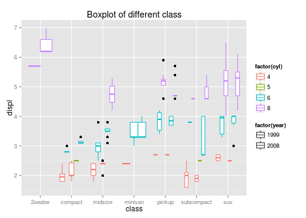
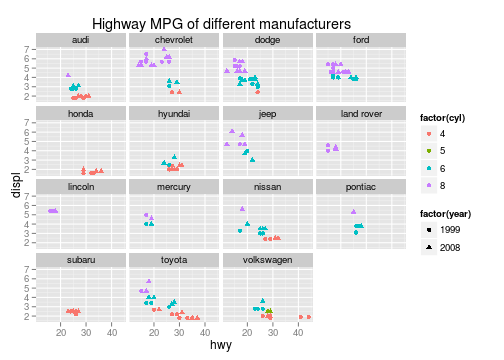

## Concepts

EPA announces the fuel economy of cars every year. 
We can compare the gas-consuming among different engine sizes, classes and manufacturers.
Comparison will be done by graphes discribed as below.

1. scatter plot of highway milage against engine displacement
2. boxplot by class
3. scatter plot of highway milage against engine displacement by manufacturers

Additionally we can choose years such as 1999, 2008 and both years.

----

## 1. MPG graph by engine size

This selection shows scatter plot of highway mpg against engine displacement. 

 

-----

## 2. Boxplot by class

This selection shows boxplot of highway mpg by car classes

 

-----

## 3. MPG graph by manufacturer

This selection shows scatter plot of highway mpg by car manufacturer

 

